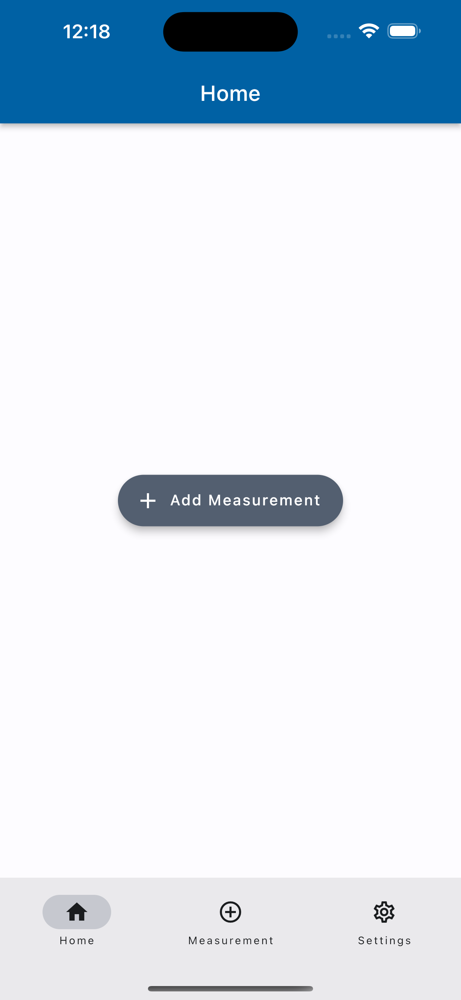
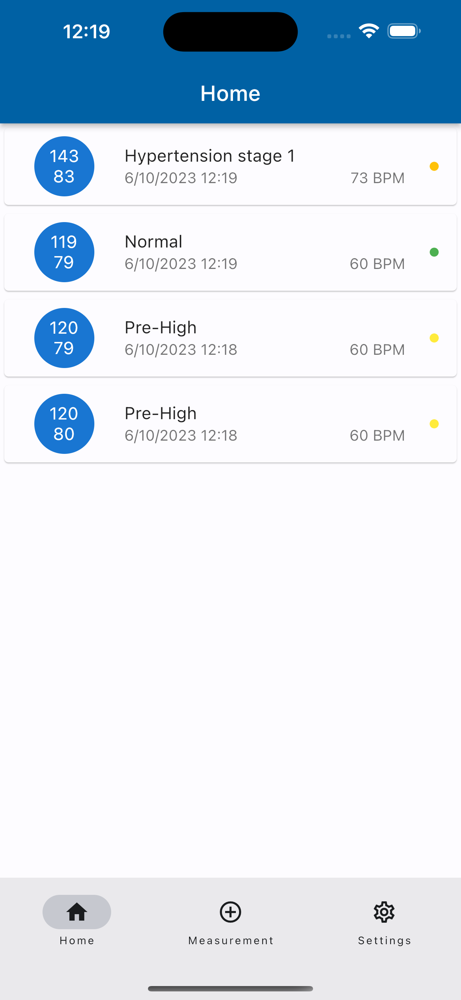
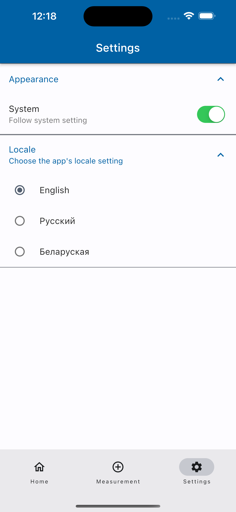

# sys-dia-log-flutter

 

> Blood pressure diary.

[![CI [branch]](https://github.com/Sys-Dia-Log/sys-dia-log/actions/workflows/ci-branch.yml/badge.svg)](<https://github.com/Sys-Dia-Log/sys-dia-log/actions/workflows/ci-branch.yml>)

<!-- allowed_elements -->

  
  
  

